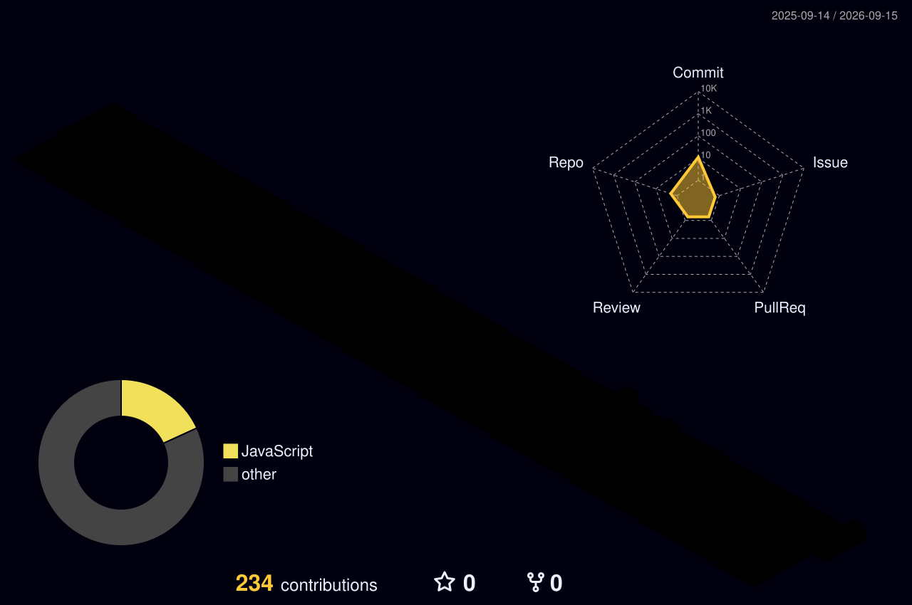

<!-- ══════════════════════════ HEADER ══════════════════════════ -->
<a href="https://github.com/KhaydenChetty">
  
</a>

<p align="center">
  <a href="https://github.com/KhaydenChetty">
    
  </a>
</p>

<p align="center">
  
  
  
</p>

<!-- ══════════════════════════ ABOUT ══════════════════════════ -->
<h2 align="center">
  
  &nbsp;<code>whoami</code>
</h2>

```kotlin
class Developer(
    val name: String = "Khayden Chetty",
    val focus: String = "Application Development · Mobile Devices",
    val primary: String = "Kotlin",
    val alsoWields: List<String> = listOf("SQL", "Java", "C#", "HTML", "CSS"),
    val automates: List<String> = listOf("PowerShell", "Power Automate"),
    val currentlyLearning: String = "// always something new"
) {
    fun buildCoolThings() = alsoWields + primary
}
```

<!-- ══════════════════════════ TECH STACK ══════════════════════════ -->
<h2 align="center"><code>&gt; stack --list</code></h2>

<p align="center">
  <a href="https://skillicons.dev">
    
  </a>
</p>

<table align="center">
  <tr>
    <td align="center"></td>
    <td align="center"></td>
    <td align="center"></td>
    <td align="center"></td>
  </tr>
  <tr>
    <td align="center"></td>
    <td align="center"></td>
    <td align="center"></td>
    <td align="center"></td>
  </tr>
</table>

<!-- ══════════════════════════ GITHUB STATS ══════════════════════════ -->
<h2 align="center"><code>&gt; stats --live</code></h2>

<p align="center">
  <a href="https://github.com/KhaydenChetty">
    
  </a>
  <a href="https://github.com/KhaydenChetty">
    
  </a>
</p>

<p align="center">
  <a href="https://github.com/KhaydenChetty">
    
  </a>
  <a href="https://github.com/KhaydenChetty">
    
  </a>
</p>

<!-- ══════════════════════════ TROPHIES ══════════════════════════ -->
<h2 align="center"><code>&gt; achievements</code></h2>

<p align="center">
  <a href="https://github.com/ryo-ma/github-profile-trophy">
    
  </a>
</p>

<!-- ══════════════════════════ ACTIVITY GRAPH ══════════════════════════ -->
<h2 align="center"><code>&gt; activity.log</code></h2>

<p align="center">
  <a href="https://github.com/ashutosh00710/github-readme-activity-graph">
    
  </a>
</p>

<!-- ══════════════════════════ 3D CONTRIB (workflow output) ══════════════════════════ -->
<h2 align="center"><code>&gt; render --isometric</code></h2>

<p align="center">
  
</p>

<!-- ══════════════════════════ SNAKE (workflow output) ══════════════════════════ -->
<h2 align="center"><code>&gt; snake --devour</code></h2>

<picture>
  <source media="(prefers-color-scheme: dark)" srcset="https://raw.githubusercontent.com/KhaydenChetty/KhaydenChetty/output/github-snake-dark.svg" />
  <source media="(prefers-color-scheme: light)" srcset="https://raw.githubusercontent.com/KhaydenChetty/KhaydenChetty/output/github-snake.svg" />
  
</picture>

<!-- ══════════════════════════ METRICS (lowlighter workflow output) ══════════════════════════ -->
<h2 align="center"><code>&gt; metrics --deep-scan</code></h2>

<p align="center">
  
  
</p>
<p align="center">
  
  
</p>
<p align="center">
  
  
</p>

<!-- ══════════════════════════ QUOTE ══════════════════════════ -->
<h2 align="center"><code>&gt; fortune</code></h2>

<p align="center">
  <a href="https://github.com/piyushsuthar/github-readme-quotes">
    
  </a>
</p>

<!-- ══════════════════════════ SOCIALS ══════════════════════════ -->
<h2 align="center"><code>&gt; connect</code></h2>

<p align="center">
  <a href="mailto:kaskhayden@gmail.com">
    
  </a>
  <a href="https://github.com/KhaydenChetty">
    
  </a>
  <!-- Add LinkedIn / X / portfolio here when you have them -->
</p>

<!-- ══════════════════════════ FOOTER ══════════════════════════ -->


<p align="center"><sub>⚡ Auto-refreshed by GitHub Actions · Powered by too much caffeine ⚡</sub></p>
