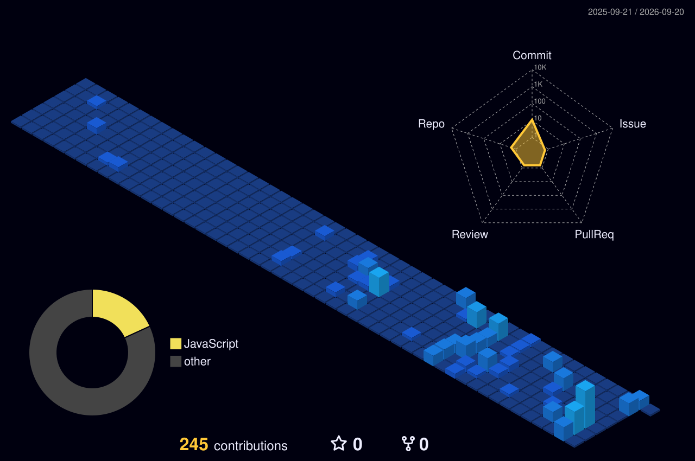

<div align="center">
  
</div>

<br />

## `> whoami`

I'm an application developer who likes building practical software — things that solve an actual problem for an actual person. I work mostly across mobile and desktop applications, I automate the repetitive parts of systems that shouldn't be manual, and I spend a lot of time on the plumbing in between: databases, APIs, and the Microsoft tooling that holds real workplaces together.

I care less about which language a thing is written in and more about whether it works, whether I understand *why* it works, and whether the next person can read it.

```kotlin
val khayden = Developer(
    role      = "Application Developer",
    pillars   = listOf("Software", "Automation", "Systems"),
    approach  = "build it, understand it, then make it look good",
    based     = "South Africa"
)
```

<br />

## `> currently --building`

```text
[ACTIVE]    dynacon-finance — mobile finance tracking for a construction business
[LEARNING]  Kotlin / Android — deepening mobile application work
[EXPLORING] Azure Functions and serverless application patterns
[ONGOING]   automation tooling in PowerShell and Power Automate
```

<sub>Last reviewed: August 2026</sub>

<br />

## `> what i build`

**Applications** — mobile and desktop tools that solve a specific, practical problem rather than demonstrate a framework.

**Automation** — removing manual, repetitive work. PowerShell for the systems side, Power Automate for the workflow side.

**Integration** — connecting APIs, spreadsheets, services and databases so that separate systems behave like one.

**Experimentation** — deliberately picking unfamiliar technology on small projects to find out how it actually behaves.

<br />

## `> systems --list`

<table>
<tr>
<td><b>Primary</b></td>
<td>


</td>
</tr>
<tr>
<td><b>Working with</b></td>
<td>


</td>
</tr>
<tr>
<td><b>Automation</b></td>
<td>


</td>
</tr>
<tr>
<td><b>Platform</b></td>
<td>


</td>
</tr>
<tr>
<td><b>Tools</b></td>
<td>


</td>
</tr>
</table>

<br />

## `> projects --featured`

### `01` · [dynacon-finance](https://github.com/KhaydenChetty/dynacon-finance)

**A mobile-first finance tracker built for a construction business.**

Site staff needed to record and review finances from a phone, on site, without a heavyweight accounting package or a per-seat licence. This uses GitHub Pages for hosting and Google Sheets as the backend, so the business keeps its data somewhere it already understands and can audit — while the interface stays fast and mobile-first.

`JavaScript` · `Google Sheets API` · `GitHub Pages`

<!-- TODO: add a screenshot — assets/projects/dynacon-finance.png — then uncomment:

-->

<br />

### `02` · [Azure Functions — Serverless Task Service](https://github.com/KhaydenChetty/IceTask4.CLDV6211)

**A serverless C# service built on Azure Functions.**

<!-- TODO: replace with what this actually does — the trigger type, what it processes, and why serverless was the right shape for it. -->
An exercise in event-driven architecture: HTTP-triggered functions in C#, deployed to Azure, with no server to provision or maintain. Built to understand where serverless genuinely reduces operational overhead versus where it just moves the complexity.

`C#` · `.NET` · `Azure Functions`

<br />

### `03` · [SnapClappedApp](https://github.com/KhaydenChetty/SnapClappedApp)

<!-- TODO: this repo has no description on GitHub. Write one line on what it does and why you built it, then update this block. -->
**A C# application.**

`C#` · `.NET`

<br />

<details>
<summary><b><code>&gt; projects --archive</code></b> &nbsp;·&nbsp; coursework and early work</summary>

<br />

Academic and practice work from my studies at Varsity College. Kept public for transparency — not intended as portfolio pieces.

| Repository | Context |
| --- | --- |
| [ST10448657-PROG5121-POE](https://github.com/KhaydenChetty/ST10448657-PROG5121-POE) | PROG5121 portfolio of evidence |
| [PRACTTEST](https://github.com/KhaydenChetty/PRACTTEST) | Java practical test |
| [KAPKiRiGi](https://github.com/KhaydenChetty/KAPKiRiGi) | Early Java experiment |
| [TutorConnect](https://github.com/KhaydenChetty/TutorConnect) | Fork — group project |
| [weather-api-multiendpoint](https://github.com/KhaydenChetty/weather-api-multiendpoint) | Fork — API experiment |

</details>

<br />

## `> activity --matrix`

<div align="center">
  
</div>

<br />

## `> development.philosophy`

```text
Build something useful.
Understand how it works.
Automate what shouldn't be repetitive.
Make complicated systems understandable.
Then make it look good.
```

<br />

## `> connect`

<a href="mailto:kaskhayden@gmail.com">
  
</a>
<a href="https://github.com/KhaydenChetty">
  
</a>
<!-- TODO: add when available
<a href="https://linkedin.com/in/YOUR-HANDLE">
  
</a>
-->

<br />
<br />

<div align="center">
  
</div>
